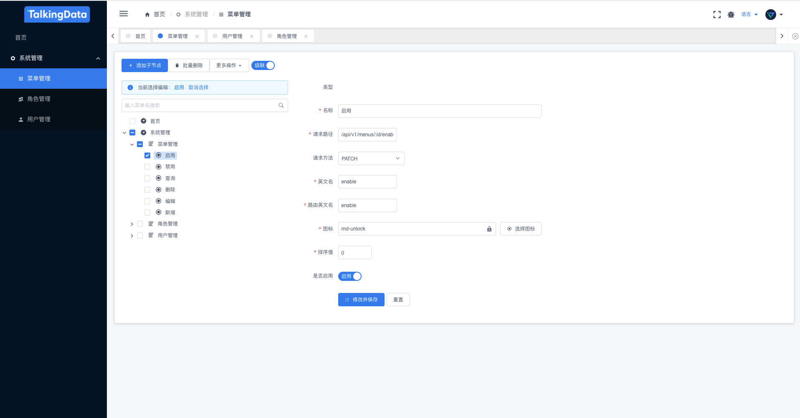

<h1>
ZView
    <h3>ZView based on iView.</h3>
</h1>

[](https://github.com/iview/iview-admin/releases)
[](https://travis-ci.org/iview/iview-admin)
[](https://github.com/vuejs/vue)
[](https://github.com/iview/iview)
[]()

## Introduction

基于[iView](https://github.com/iview/iview)搭建的带权限管理的后台管理系统前端组件




## 新加特性

- 权限管理
    - 动态菜单
    - 权限过滤
- 登录验证码

## Getting started
```bush
# clone the project
git clone https://github.com/zzpu/zview.git

// install dependencies
npm install

// develop
npm run dev
```

## Build
```bush
npm run build
```

## License
[MIT](http://opensource.org/licenses/MIT)

